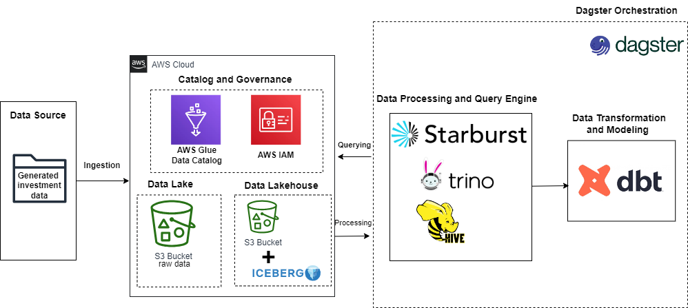
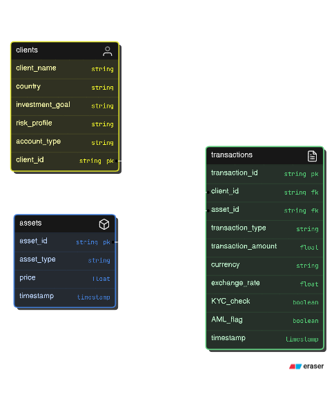

# Data Lakehouse Project

Welcome to the Data Lakehouse Project! This project aims to create a robust, scalable data platform that merges the flexibility of data lakes with the performance of data warehouses. By leveraging modern data engineering tools such as Apache Iceberg, dbt, Trino (via Starburst Galaxy), and Dagster, this project supports various data analytics, reporting, and machine learning workloads efficiently.

## Project Overview

The Data Lakehouse Project integrates the flexibility of a data lake with the performance and reliability of a data warehouse, providing a unified platform for data storage, processing, and analytics.

## Architecture Diagram

This architecture diagram outlines the components involved in the data lakehouse setup, from data ingestion and storage in AWS S3 to data transformation and processing using Apache Iceberg, dbt, and Starburst Trino.

## Datasets Used

The project uses synthetic datasets that simulate real-world scenarios to analyze investment behaviors and trends. These datasets include:

- **Clients**: Information about clients, including their investment goals and risk profiles.
- **Assets**: Data on various asset types, including their prices and timestamps.
- **Transactions**: Transactional data detailing client interactions with assets, including transaction types and amounts.

### Dataset Schema

## Tech Stack

- **Amazon S3**: Used as the storage layer for raw and processed data.
- **Apache Iceberg**: Manages large tabular datasets and supports ACID transactions.
- **Starburst Trino**: Provides SQL query capabilities across the data lakehouse.
- **dbt (Data Build Tool)**: Manages SQL-based data transformations and testing.
- **Dagster**: Orchestrates the data pipeline, ensuring seamless data flow and automation.

## Data lakehouse pipeline Process

1. AWS S3 Buckets
Bucket Setup: Raw data is stored in AWS S3, organized into different folders for various datasets such as clients, assets, and transactions.

2. Apache Iceberg and Hive Table Creation in Starburst
Iceberg Table Creation: Data is organized into Apache Iceberg tables in Starburst Galaxy for better performance and scalability.

Example Iceberg Table Creation Query:

Hive External Table Creation: Hive external tables are used for ingesting raw data into Iceberg tables.

Example Hive Table Creation Query:

3. Data Transformation with dbt

Staging Models: Clean and standardize raw data to make it ready for transformation.

Dimension and Fact Models: Create enriched lookup tables and fact tables for analytical purposes.

Advanced Transformations: Implement complex transformations using window functions, statistical methods, and other advanced SQL techniques.

4. Data Pipeline Orchestration with Dagster
Pipeline Setup: Dagster is used to orchestrate the entire data pipeline, from data ingestion to transformation and reporting.

5. Testing and Validation
Data Quality Checks: Implement schema tests and custom tests to ensure data integrity and quality.

6. Documentation and Lineage
dbt Docs: Generate and visualize data lineage using dbt docs to understand the flow of data through different models.

## Future Enhancements
Machine Learning Integration: Plan to integrate machine learning models for predictive analytics and real-time decision-making.
Real-Time Data Processing: Implement real-time or near-real-time data ingestion and processing capabilities.
Data Security and Governance: Enhance security and governance frameworks to comply with industry standards.
